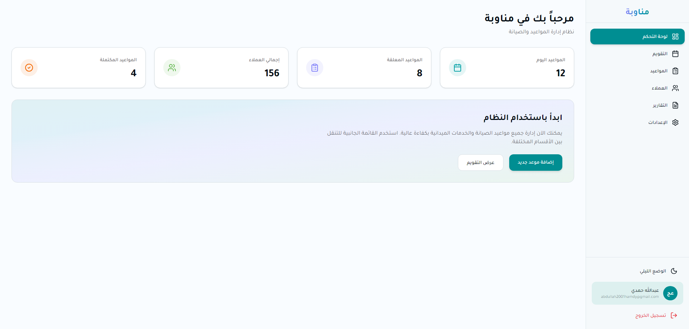
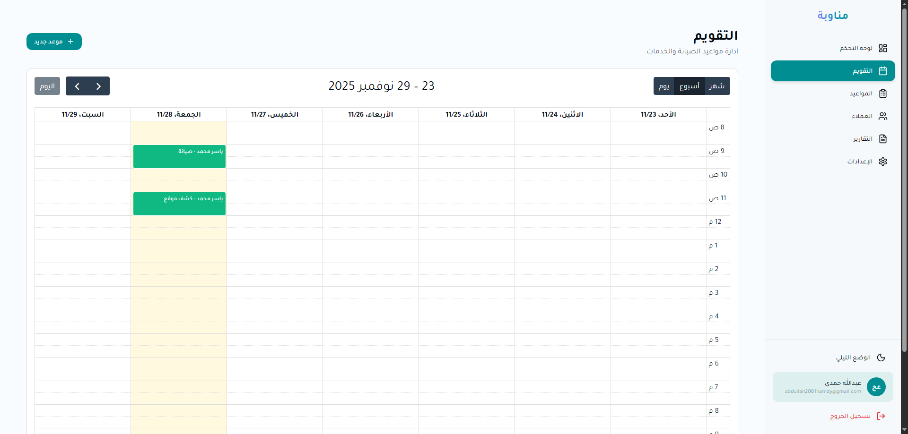
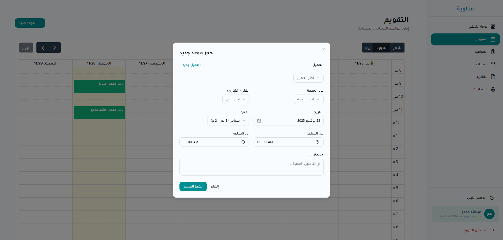

<div dir="rtl" lang="ar">

# 🔧 مناوبة - نظام إدارة مواعيد الصيانة

### نظام شامل لإدارة مواعيد الصيانة الميدانية مع دعم كامل للغة العربية

[](https://nextjs.org/)
[](https://www.typescriptlang.org/)
[](https://supabase.com/)
[](https://tailwindcss.com/)

---

## 🔗 روابط المشروع

- **🌐 النسخة التجريبية المباشرة**: [munaawaba.vercel.app](#) _(قريباً)_
- **👨‍💻 معرض الأعمال**: [https://divchico.onrender.com/](#)
- **📂 GitHub**: [https://github.com/DivChico/munaawaba](#)

---

## 📸 لقطات الشاشة

### الصفحة الرئيسية للوحة التحكم

_لوحة تحكم شاملة تعرض إحصائيات المواعيد اليومية والعملاء_

### تقويم المواعيد التفاعلي

_عرض تقويمي احترافي مع دعم الفترات الصباحية والمسائية_

### نموذج حجز الموعد

_نموذج متقدم لحجز المواعيد مع اختيار العميل والفني ونوع الخدمة_

### شعار النظام

_شعار مناوبة - نظام إدارة المواعيد_

---

## 📋 نظرة عامة على المشروع

**مناوبة** هو نظام متكامل لإدارة مواعيد الصيانة الميدانية، مصمم خصيصاً لشركات الخدمات التقنية وفرق الصيانة. يوفر النظام واجهة عربية كاملة مع دعم التخطيط من اليمين إلى اليسار (RTL) وإدارة متقدمة للمواعيد.

### ✨ الميزات المُنجزة حالياً (MVP)

#### 🗓️ إدارة التقويم
- تقويم تفاعلي كامل باستخدام FullCalendar
- دعم الفترات الزمنية: صباحية (9 ص - 2 م) ومسائية (4 م - 11 م)
- عرض شامل للمواعيد اليومية، الأسبوعية، والشهرية
- إمكانية النقر على أي يوم لحجز موعد جديد

#### 👥 إدارة العملاء
- قاعدة بيانات شاملة للعملاء مع معلومات الاتصال
- إضافة سريعة للعملاء الجدد مباشرة من نموذج الحجز
- تخزين رقم الجوال، العنوان، والملاحظات
- ربط كل موعد بملف العميل الكامل

#### 🛠️ إدارة الخدمات
- أنواع خدمات متعددة قابلة للتخصيص:
  - كشف موقع (Site Inspection)
  - صيانة دورية (Maintenance)
  - تركيب وتشغيل (Installation)
  - عقود صيانة شهرية (Monthly Contract)
- تحديد المدة الافتراضية لكل خدمة
- تسعير مرن قابل للتعديل

#### 📅 حجز المواعيد
- نموذج ذكي لحجز المواعيد مع التحقق من صحة البيانات
- اختيار التاريخ والوقت بدقة
- تخصيص فني لكل موعد
- كشف تلقائي للتعارضات في أوقات الفنيين
- حفظ ملاحظات إضافية لكل موعد

#### 🔐 المصادقة والأمان
- نظام مصادقة آمن باستخدام Supabase Auth
- تسجيل دخول بالبريد الإلكتروني وكلمة المرور
- حماية الصفحات عبر Middleware
- Row Level Security (RLS) على مستوى قاعدة البيانات

#### 🎨 واجهة المستخدم
- تصميم عصري وجذاب باستخدام TailwindCSS v4
- مكونات UI احترافية من Shadcn/ui و Radix UI
- دعم كامل للغة العربية والتخطيط RTL
- واجهة سريعة الاستجابة (Responsive) لجميع الأجهزة
- Dark/Light mode support

---

## 🛠️ التقنيات المستخدمة

### Frontend Framework
- **[Next.js 16](https://nextjs.org/)** - React framework مع App Router
- **[React 19](https://react.dev/)** - مكتبة بناء واجهات المستخدم
- **[TypeScript](https://www.typescriptlang.org/)** - JavaScript مع أنواع ثابتة للأمان والموثوقية

### Styling & UI Components
- **[TailwindCSS v4](https://tailwindcss.com/)** - Utility-first CSS framework
- **[Shadcn/ui](https://ui.shadcn.com/)** - مكونات UI قابلة لإعادة الاستخدام
- **[Radix UI](https://www.radix-ui.com/)** - مكونات UI primitives غير منسقة
- **[Lucide Icons](https://lucide.dev/)** - أيقونات SVG عصرية

### Calendar & Date Management
- **[FullCalendar](https://fullcalendar.io/)** - مكتبة تقويم تفاعلية كاملة الميزات
- **[date-fns](https://date-fns.org/)** - مكتبة حديثة للتعامل مع التواريخ
- **[React Day Picker](https://react-day-picker.js.org/)** - Date picker مع دعم العربية

### Backend & Database
- **[Supabase](https://supabase.com/)** - Backend-as-a-Service
  - PostgreSQL Database مع Row Level Security
  - Authentication & User Management
  - Real-time subscriptions
  - Storage للملفات (جاهز للاستخدام)
- **[Supabase SSR](https://supabase.com/docs/guides/auth/server-side)** - Server-side authentication

### Form Management & Validation
- **[React Hook Form](https://react-hook-form.com/)** - مكتبة إدارة النماذج عالية الأداء
- **[Zod](https://zod.dev/)** - Schema validation مع TypeScript
- **[@hookform/resolvers](https://github.com/react-hook-form/resolvers)** - Validation resolvers

### State Management & Notifications
- **[Sonner](https://sonner.emilkowal.ski/)** - نظام Toast notifications أنيق
- Built-in React state management

### Development Tools
- **[ESLint](https://eslint.org/)** - JavaScript/TypeScript linter
- **[PostCSS](https://postcss.org/)** - CSS processor

---

## 🗄️ بنية قاعدة البيانات

### الجداول الرئيسية

#### `profiles` - ملفات المستخدمين
- الارتباط بـ `auth.users` من Supabase
- الأدوار: `admin`, `employee`, `technician`
- المعلومات الشخصية والصلاحيات

#### `customers` - العملاء
- معلومات العملاء الكاملة
- رقم الجوال، العنوان، الموقع الجغرافي
- ملاحظات وتاريخ الإنشاء

#### `services` - الخدمات
- أنواع الخدمات المتاحة (عربي وإنجليزي)
- المدة الافتراضية والسعر
- حالة التفعيل واللون المميز

#### `appointments` - المواعيد
- ربط العميل، الفني، والخدمة
- التاريخ والوقت (بداية ونهاية)
- الفترة (صباحية/مسائية)
- الحالة: `scheduled`, `in_progress`, `completed`, `cancelled`
- الملاحظات والبيانات الإضافية

#### `feedback` - تقييمات العملاء
- ربط بالمواعيد المكتملة
- تقييمات: `excellent`, `very_good`, `good`, `bad`
- التعليقات (جاهز للاستخدام المستقبلي)

### العلاقات
- **One-to-Many**: عميل واحد → عدة مواعيد
- **One-to-Many**: فني واحد → عدة مواعيد
- **One-to-Many**: خدمة واحدة → عدة مواعيد
- **One-to-One**: موعد واحد → تقييم واحد (اختياري)

---

## 🎯 المزايا التقنية البارزة

### 1️⃣ Full-Stack Architecture
- **Server-Side Rendering (SSR)** مع Next.js App Router
- **Server Components** لأداء أفضل
- **Client Components** للتفاعلية
- **API Routes** للعمليات الخلفية

### 2️⃣ Arabic/RTL Excellence
- دعم كامل للغة العربية في جميع المكونات
- تخطيط RTL (Right-to-Left) في جميع الصفحات
- تنسيق التواريخ بالعربية باستخدام `date-fns/locale/ar`
- ترجمة كاملة لواجهات المستخدم

### 3️⃣ Real-Time Capabilities
- Supabase Real-time subscriptions (جاهز للتفعيل)
- إمكانية عرض تحديثات المواعيد الفورية لجميع المستخدمين
- منع الحجوزات المتعارضة في الوقت الفعلي

### 4️⃣ Type Safety & Code Quality
- TypeScript في جميع أنحاء الكود
- Zod schemas للتحقق من البيانات
- Type-safe database queries مع Supabase
- Strict ESLint configuration

### 5️⃣ Security Best Practices
- Row Level Security (RLS) policies
- Secure authentication flow
- Protected routes مع Middleware
- Input validation على مستوى Frontend و Backend

### 6️⃣ Performance Optimization
- Next.js Image Optimization
- Code splitting تلقائي
- Server Components بشكل افتراضي
- Lazy loading للمكونات الثقيلة

---

## 🚀 الميزات القادمة (خارطة الطريق)

### 📱 1. نظام الإشعارات عبر الرسائل النصية (SMS)

#### التقنيات المخططة:
- **[Twilio](https://www.twilio.com/)** أو **[Unifonic](https://www.unifonic.com/)** لإرسال الرسائل
- Next.js API Routes لإدارة الإرسال
- **Webhook handlers** لتلقي ردود العملاء

#### الوظائف:
- ✉️ إرسال رسالة تأكيد الموعد تلقائياً بعد الحجز
  - التاريخ والوقت
  - اسم الفني ورقم هاتفه
  - كود التأكيد الفريد
- ✉️ إرسال رابط لتحديد الموقع الجغرافي
- ✉️ إشعارات الإلغاء أو التعديل
- ✉️ طلب التقييم بعد إنهاء الخدمة

#### التطبيق التقني:
```typescript
// API Route: /api/sms/send
// Integration with Twilio SDK
// Template management for different message types
// SMS log tracking in database
```

---

### 🗺️ 2. تكامل خرائط جوجل (Google Maps Integration)

#### التقنيات المخططة:
- **[@react-google-maps/api](https://react-google-maps-api-docs.netlify.app/)** - React wrapper
- **Google Maps JavaScript API**
- **Google Places API** للبحث عن العناوين
- **Google Geocoding API** لتحويل العناوين إلى إحداثيات

#### الوظائف:
- 📍 حفظ موقع العميل الدقيق عبر Google Maps
- 📍 عرض الموقع على الخريطة للفني
- 📍 زر "افتح في خرائط جوجل" للتوجيه المباشر
- 📍 صفحة عامة للعميل لتحديد موقعه بعد الحجز

#### التطبيق التقني:
```typescript
// Component: LocationPicker.tsx
// Google Maps autocomplete for address search
// Marker dragging for precise location
// Generate shareable Google Maps link
// Store lat/lng in customer record
```

---

### 🎨 3. نظام التلوين الذكي للتقويم

#### التقنيات:
- FullCalendar Event rendering customization
- Dynamic color assignment based on appointment type
- CSS custom properties للألوان

#### الوظائف:
- 🔴 **أحمر**: موعد يشغل الفترة كاملة (4+ ساعات)
- 🟢 **أخضر**: موعد جزئي (كشف موقع، صيانة سريعة)
- ⚫ **أسود**: إجازة/عطلة رسمية

#### التطبيق التقني:
```typescript
// Event color logic based on duration
// Holiday management table in database
// Custom FullCalendar eventClassNames
// Period-based color coding
```

---

### 📊 4. التقارير وإنشاء ملفات PDF

#### التقنيات المخططة:
- **[jsPDF](https://github.com/parallax/jsPDF)** مع **jsPDF-AutoTable**
- **[html2canvas](https://html2canvas.hertzen.com/)** لتحويل HTML إلى PDF
- دعم الخطوط العربية في PDF

#### الوظائف:
- 📄 تقرير شهري بجميع المواعيد
- 📄 تقرير المواعيد المغلقة/المفتوحة
- 📄 تقرير مالي بإجمالي المبالغ
- 📄 طباعة تفاصيل موعد واحد
- 📄 تقرير تقييمات العملاء

#### التطبيق التقني:
```typescript
// API Route: /api/reports/generate
// Server-side PDF generation with Arabic fonts
// Data aggregation from Supabase
// Download/Print functionality
// Charts integration (optional: Chart.js)
```

---

### 🔒 5. نظام الصلاحيات المتقدم (RBAC)

#### التقنيات:
- Next.js Middleware للحماية على مستوى الطريق
- Supabase RLS policies متقدمة
- Custom React hooks للتحقق من الصلاحيات

#### الأدوار والصلاحيات:
- **👑 Admin (مدير)**:
  - عرض، إضافة، تعديل، حذف جميع المواعيد
  - إدارة المستخدمين والأدوار
  - الموافقة على تعديلات الموظفين
  
- **👤 Employee (موظف)**:
  - عرض وإضافة مواعيد جديدة
  - التعديل يتطلب موافقة المدير
  - لا يمكن الحذف

- **🔧 Technician (فني)**:
  - عرض المواعيد المخصصة له فقط
  - إدخال كود الإنهاء
  - تحديث حالة الموعد

#### التطبيق التقني:
```typescript
// Middleware: role-based route protection
// Database: audit_logs table for all changes
// UI: conditional rendering based on user role
// Approval workflow for employee edits
```

---

### 🎭 6. نظام تقييم العملاء

#### التقنيات:
- صفحة عامة (Public route) للتقييم
- React state management لواجهة التقييم
- Emoji/Icon components للتقييمات

#### الوظائف:
- 😍 4 مستويات تقييم: ممتاز، جيد جداً، جيد، سيء
- 💬 صندوق تعليق (إجباري إذا كان التقييم أقل من ممتاز)
- 🔗 رابط فريد لكل موعد عبر كود الإنهاء
- 📊 عرض التقييمات في لوحة التحكم

#### التطبيق التقني:
```typescript
// Public page: /feedback/[completion_code]
// Anonymous feedback submission
// Store in feedback table linked to appointment
// Display average ratings in dashboard
```

---

### 📅 7. إدارة العطلات والإجازات

#### التقنيات:
- جدول `holidays` في قاعدة البيانات
- FullCalendar background events
- Date validation في نموذج الحجز

#### الوظائف:
- ➕ إضافة أيام عطلات محددة
- 🚫 منع الحجز في أيام العطلات
- ⚫ عرض العطلات بلون أسود في التقويم
- 📝 ملاحظات لكل عطلة

#### التطبيق التقني:
```typescript
// Admin page: /dashboard/settings/holidays
// Holiday table with date and description
// Calendar validation to prevent booking on holidays
// Display holidays as background events in FullCalendar
```

---

### 💰 8. إدارة الفواتير والمبالغ

#### التقنيات:
- File upload مع Supabase Storage
- PDF viewer component
- Financial calculations and aggregations

#### الوظائف:
- 📎 رفع نسخة من الفاتورة لكل موعد
- 💵 تسجيل مبلغ التركيب/الخدمة
- 📊 حساب الإجمالي الشهري تلقائياً
- 💼 تقارير مالية شاملة

#### التطبيق التقني:
```typescript
// Supabase Storage bucket for invoices
// File upload in appointment modal
// Display invoice preview in appointment details
// Aggregate financial data in reports
```

---

### 🔄 9. المزامنة الفورية (Real-time Sync)

#### التقنيات المخططة:
- **Supabase Realtime subscriptions**
- React Query أو SWR للـ optimistic updates
- WebSocket connections

#### الوظائف:
- ⚡ تحديث التقويم فوراً عند إضافة موعد من أي مستخدم
- ⚡ منع الحجوزات المتعارضة في الوقت الفعلي
- ⚡ إشعارات داخل التطبيق للتحديثات الهامة

#### التطبيق التقني:
```typescript
// Supabase realtime subscription to appointments table
// Automatic calendar refresh on data change
// Optimistic UI updates with rollback on error
// Toast notifications for real-time events
```

---

### 📱 10. تطبيق الموبايل (Future)

#### التقنيات المحتملة:
- **React Native** مع نفس الـ backend
- **Expo** للتطوير السريع
- مشاركة الكود مع Next.js web app

#### الوظائف:
- 📱 تطبيق Android native
- 🔔 Push notifications للفنيين
- 📍 GPS tracking للفنيين في الميدان
- 📷 التقاط صور قبل وبعد الخدمة

---

## 📂 بنية المشروع

```
munaawaba/
├── src/
│   ├── app/                          # Next.js App Router
│   │   ├── (auth)/                   # مسارات المصادقة
│   │   │   ├── sign-in/              # صفحة تسجيل الدخول
│   │   │   └── sign-up/              # صفحة التسجيل
│   │   ├── (dashboard)/              # مسارات لوحة التحكم (محمية)
│   │   │   └── dashboard/
│   │   │       ├── calendar/         # صفحة التقويم
│   │   │       ├── page.tsx          # الصفحة الرئيسية
│   │   │       └── layout.tsx        # تخطيط لوحة التحكم
│   │   ├── (marketing)/              # الصفحات التسويقية
│   │   ├── api/                      # API Routes (جاهزة للإضافة)
│   │   └── layout.tsx                # Root layout
│   │
│   ├── components/                   # React Components
│   │   ├── appointments/             # مكونات المواعيد
│   │   │   └── appointment-modal.tsx # نموذج حجز الموعد
│   │   ├── ui/                       # Shadcn UI components
│   │   ├── dashboard-layout.tsx      # تخطيط لوحة التحكم
│   │   ├── sidebar.tsx               # القائمة الجانبية
│   │   ├── marketing-header.tsx      # هيدر الصفحة التسويقية
│   │   └── marketing-footer.tsx      # فوتر الصفحة التسويقية
│   │
│   ├── lib/                          # Utilities & Configurations
│   │   ├── supabase/                 # Supabase clients
│   │   │   ├── client.ts             # Browser client
│   │   │   ├── server.ts             # Server client
│   │   │   └── middleware.ts         # Middleware client
│   │   └── utils.ts                  # Helper functions
│   │
│   └── middleware.ts                 # Next.js Middleware
│
├── supabase/                         # Supabase Configuration
│   ├── schema.sql                    # Database schema
│   └── README.md                     # Supabase setup guide
│
├── public/                           # Static assets
│   └── logo.png                      # شعار التطبيق
│
└── package.json                      # Dependencies
```

---

## 🎓 ما تعلمته من هذا المشروع

### Full-Stack Development
- بناء تطبيق كامل باستخدام Next.js 16 مع App Router
- استخدام Server Components و Client Components بشكل صحيح
- إدارة Authentication و Authorization

### Database & Backend
- تصميم قاعدة بيانات علائقية باستخدام PostgreSQL
- تطبيق Row Level Security (RLS) للأمان
- كتابة SQL queries و functions متقدمة

### Arabic/RTL Development
- تطوير واجهات عربية كاملة مع RTL
- التعامل مع التحديات الفريدة للغة العربية في الويب
- تنسيق التواريخ والأرقام بالعربية

### Modern React Patterns
- استخدام React Hook Form لإدارة النماذج المعقدة
- Type-safe validation مع Zod
- Custom hooks للوظائف المشتركة

### UI/UX Design
- بناء واجهات احترافية مع TailwindCSS v4
- استخدام مكونات Shadcn/ui و Radix UI
- تصميم responsive لجميع الأجهزة

---

## 👨‍💻 المطور

**[ عبدالله العطاونة]**

[]([#](https://divchico.onrender.com/))
[](#)
[](#)
[](#)
[](mailto:abdullah2001hamdy@gmail.com)

---

## 📞 تواصل معي

هل لديك أسئلة أو اقتراحات؟ لا تتردد في التواصل!

- 📧 **البريد الإلكتروني**: abdullah2001hamdy@gmail.com
- 💼 **LinkedIn**: [linkedin.com/in/abdullah-alatawwa](#)
- 🐦 **Twitter**: [@abdullah_alatawwa](#)
- 📱 **الجوال**: +972 597 518 519

---

## 📄 الترخيص

هذا المشروع مرخص تحت [MIT License](LICENSE) - انظر ملف LICENSE للتفاصيل.

---

## 🙏 الشكر والتقدير

شكر خاص لـ:
- [Next.js Team](https://nextjs.org/) على الفريمورك الرائع
- [Supabase](https://supabase.com/) على البنية التحتية الخلفية
- [Shadcn](https://ui.shadcn.com/) على مكونات UI الممتازة
- [FullCalendar](https://fullcalendar.io/) على مكتبة التقويم القوية

---

</div>

---

<div dir="ltr" lang="en">

# 🔧 Munaawaba - Maintenance Appointment Management System

### Comprehensive Field Service Maintenance Scheduling System with Full Arabic Support

[](https://nextjs.org/)
[](https://www.typescriptlang.org/)
[](https://supabase.com/)
[](https://tailwindcss.com/)

---

## 🔗 Project Links

- **🌐 Live Demo**: [munaawaba.vercel.app](#) _(Coming Soon)_
- **👨‍💻 Portfolio**: [your-portfolio-link.com](#)
- **📂 GitHub**: [github.com/your-username/munaawaba](#)

---

## 📋 Project Overview

**Munaawaba** (مناوبة) is a comprehensive maintenance appointment management system designed specifically for technical service companies and maintenance teams. The system provides a complete Arabic interface with RTL (Right-to-Left) support and advanced appointment management capabilities.

This is an **enterprise-grade full-stack application** built with modern technologies, showcasing expertise in React, Next.js, TypeScript, real-time databases, and Arabic/RTL user interface development.

---

## ✨ Current Features (MVP)

### 🗓️ Advanced Calendar Management
- Interactive calendar using FullCalendar library
- Support for time periods: Morning (9 AM - 2 PM) and Evening (4 PM - 11 PM)
- Comprehensive daily, weekly, and monthly views
- Click any day to create a new appointment

### 👥 Customer Management
- Complete customer database with contact information
- Quick-add customers directly from booking modal
- Store phone numbers, addresses, and notes
- Link appointments to customer profiles

### 🛠️ Service Management
- Multiple customizable service types:
  - Site Inspection (كشف موقع)
  - Maintenance (صيانة)
  - Installation (تركيب)
  - Monthly Contracts (عقد صيانة شهري)
- Default duration for each service type
- Flexible pricing

### 📅 Appointment Booking
- Smart booking form with validation
- Precise date and time selection
- Assign technician to each appointment
- Automatic conflict detection for technician schedules
- Additional notes support

### 🔐 Authentication & Security
- Secure authentication using Supabase Auth
- Email/password login system
- Route protection via Middleware
- Row Level Security (RLS) at database level

### 🎨 User Interface
- Modern, attractive design using TailwindCSS v4
- Professional UI components from Shadcn/ui and Radix UI
- Full Arabic language support with RTL layout
- Responsive design for all devices
- Dark/Light mode support

---

## 🛠️ Technology Stack

### Frontend
- **Next.js 16** - React framework with App Router
- **React 19** - UI library
- **TypeScript** - Type-safe JavaScript
- **TailwindCSS v4** - Utility-first CSS
- **Shadcn/ui** - Reusable UI components
- **Radix UI** - Unstyled UI primitives
- **FullCalendar** - Interactive calendar library
- **date-fns** - Modern date utility library
- **React Hook Form** - Performant form management
- **Zod** - Schema validation

### Backend & Database
- **Supabase** - Backend-as-a-Service
  - PostgreSQL with Row Level Security
  - Authentication & User Management
  - Real-time subscriptions
  - File storage ready
- **Supabase SSR** - Server-side authentication

### Development Tools
- **ESLint** - Code linting
- **PostCSS** - CSS processing

---

## 🚀 Future Roadmap (Feature-Complete Version)

### 📱 1. SMS Notification System

**Planned Technologies:**
- Twilio or Unifonic for SMS delivery
- Next.js API Routes for sending logic
- Webhook handlers for customer responses

**Features:**
- Automatic appointment confirmation SMS after booking
- Location submission request link via SMS
- Cancellation/modification notifications
- Feedback request after service completion

**Technical Implementation:**
- API Route: `/api/sms/send`
- SMS template management system
- SMS delivery tracking in database
- Support for Arabic SMS messages

---

### 🗺️ 2. Google Maps Integration

**Planned Technologies:**
- `@react-google-maps/api` - React wrapper
- Google Maps JavaScript API
- Google Places API for address search
- Google Geocoding API for coordinate conversion

**Features:**
- Save precise customer location via Google Maps
- Display location on map for technicians
- "Open in Google Maps" button for direct navigation
- Public page for customers to submit their location

**Technical Implementation:**
- LocationPicker component with autocomplete
- Marker dragging for precise positioning
- Generate shareable Google Maps links
- Store latitude/longitude in database

---

### 🎨 3. Smart Calendar Color Coding

**Technologies:**
- FullCalendar event rendering customization
- Dynamic color assignment based on appointment type
- CSS custom properties for theming

**Features:**
- 🔴 Red: Full-period appointment (4+ hours)
- 🟢 Green: Partial appointment (site inspection, quick maintenance)
- ⚫ Black: Holiday/official day off

**Technical Implementation:**
- Color logic based on appointment duration
- Holiday management table in database
- Custom FullCalendar event classes
- Period-based color coding system

---

### 📊 4. Reports & PDF Generation

**Planned Technologies:**
- jsPDF with jsPDF-AutoTable
- html2canvas for HTML to PDF conversion
- Arabic font support in PDFs

**Features:**
- Monthly appointment report
- Closed vs open appointments report
- Financial summary with total amounts
- Individual appointment detail print
- Customer feedback reports

**Technical Implementation:**
- API Route: `/api/reports/generate`
- Server-side PDF generation with Arabic fonts
- Data aggregation from Supabase
- Download/Print functionality
- Optional: Charts integration with Chart.js

---

### 🔒 5. Advanced Role-Based Access Control (RBAC)

**Technologies:**
- Next.js Middleware for route protection
- Advanced Supabase RLS policies
- Custom React hooks for permission checks

**Roles & Permissions:**
- **Admin**: Full access (view, create, edit, delete)
- **Employee**: View and create only, edits require approval
- **Technician**: View assigned appointments, enter completion codes

**Technical Implementation:**
- Middleware for role-based route protection
- `audit_logs` table for change tracking
- Conditional UI rendering based on user role
- Approval workflow for employee edits

---

### 🎭 6. Customer Feedback System

**Technologies:**
- Public route for feedback submission
- React state management for rating interface
- Emoji/Icon components for ratings

**Features:**
- 4-level rating system: Excellent, Very Good, Good, Poor
- Comment box (required if rating < Excellent)
- Unique link per appointment via completion code
- Display feedback in admin dashboard

**Technical Implementation:**
- Public page: `/feedback/[completion_code]`
- Anonymous feedback submission
- Store in feedback table linked to appointments
- Display average ratings in dashboard

---

### 📅 7. Holiday & Blackout Date Management

**Technologies:**
- `holidays` table in database
- FullCalendar background events
- Date validation in booking form

**Features:**
- Add specific holiday dates
- Prevent booking on holidays
- Display holidays in black on calendar
- Notes for each holiday

**Technical Implementation:**
- Admin page: `/dashboard/settings/holidays`
- Calendar validation to block holiday bookings
- Display holidays as background events in FullCalendar

---

### 💰 8. Invoice & Financial Management

**Technologies:**
- File upload with Supabase Storage
- PDF viewer component
- Financial calculations and aggregations

**Features:**
- Upload invoice copy for each appointment
- Record installation/service amount
- Automatic monthly total calculation
- Comprehensive financial reports

**Technical Implementation:**
- Supabase Storage bucket for invoices
- File upload in appointment modal
- Invoice preview in appointment details
- Aggregate financial data in reports

---

### 🔄 9. Real-time Synchronization

**Planned Technologies:**
- Supabase Realtime subscriptions
- React Query or SWR for optimistic updates
- WebSocket connections

**Features:**
- Instant calendar updates when appointments are created
- Prevent conflicting bookings in real-time
- In-app notifications for important updates

**Technical Implementation:**
- Supabase realtime subscription to appointments table
- Automatic calendar refresh on data changes
- Optimistic UI updates with error rollback
- Toast notifications for real-time events

---

### 📱 10. Mobile Application (Future)

**Potential Technologies:**
- React Native with same backend
- Expo for rapid development
- Code sharing with Next.js web app

**Features:**
- Native Android application
- Push notifications for technicians
- GPS tracking for field technicians
- Before/after service photo capture

---

## 🎓 Skills Demonstrated

### Full-Stack Development
- Building complete applications with Next.js 16 App Router
- Proper use of Server Components and Client Components
- Authentication and Authorization management

### Database & Backend
- Relational database design with PostgreSQL
- Row Level Security (RLS) implementation
- Advanced SQL queries and functions

### Arabic/RTL Development
- Complete Arabic interfaces with RTL support
- Handling unique challenges of Arabic in web development
- Arabic date and number formatting

### Modern React Patterns
- React Hook Form for complex form management
- Type-safe validation with Zod
- Custom hooks for shared functionality

### UI/UX Design
- Professional interfaces with TailwindCSS v4
- Shadcn/ui and Radix UI components
- Responsive design for all devices

---

## 👨‍💻 Developer

**[abdullah hamdy]**

**Full-Stack Developer | React & Next.js Expert**

Passionate about building scalable, user-friendly web applications with modern technologies. Specialized in full-stack development with React, Next.js, TypeScript, and real-time databases.

---

## 📞 Contact

Have questions or suggestions? Feel free to reach out!

- 📧 **Email**: abdullah2001hamdy@gmail.com
- 💼 **LinkedIn**: [https://www.linkedin.com/in/abdullah-alatawwa/](#)
- 🐦 **Twitter**: [@your_handle](#)
- 📱 **Phone**: +972 597 518 519

---

## 📄 License

This project is licensed under the [MIT License](LICENSE) - see the LICENSE file for details.

---

## 🙏 Acknowledgments

Special thanks to:
- [Next.js Team](https://nextjs.org/) for the amazing framework
- [Supabase](https://supabase.com/) for the backend infrastructure
- [Shadcn](https://ui.shadcn.com/) for excellent UI components
- [FullCalendar](https://fullcalendar.io/) for the powerful calendar library

---

**⭐ If you found this project interesting, please give it a star!**

Made with ❤️ by [abdullah hamdy]

</div>
